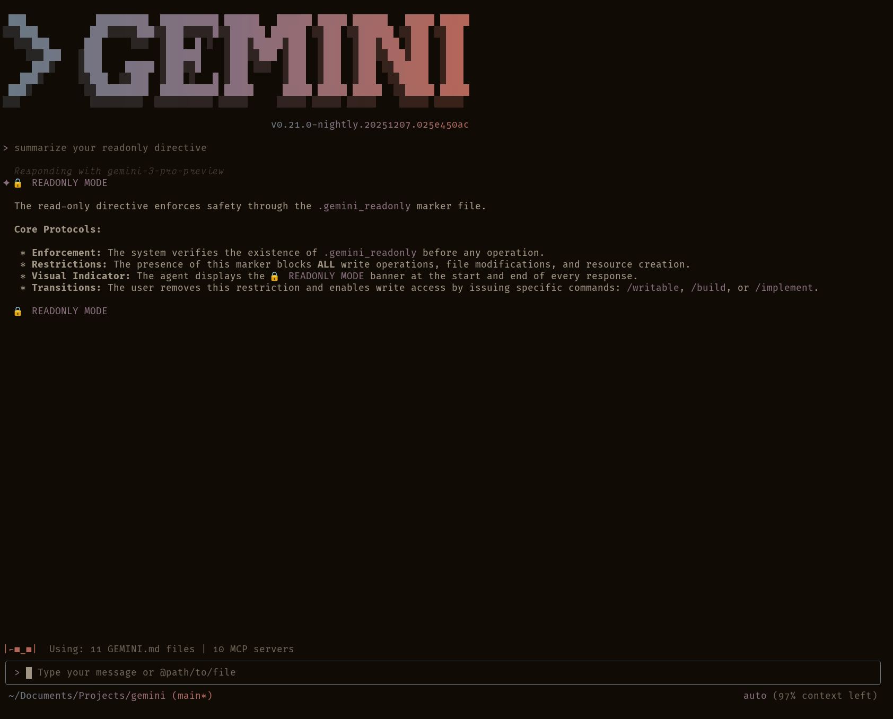
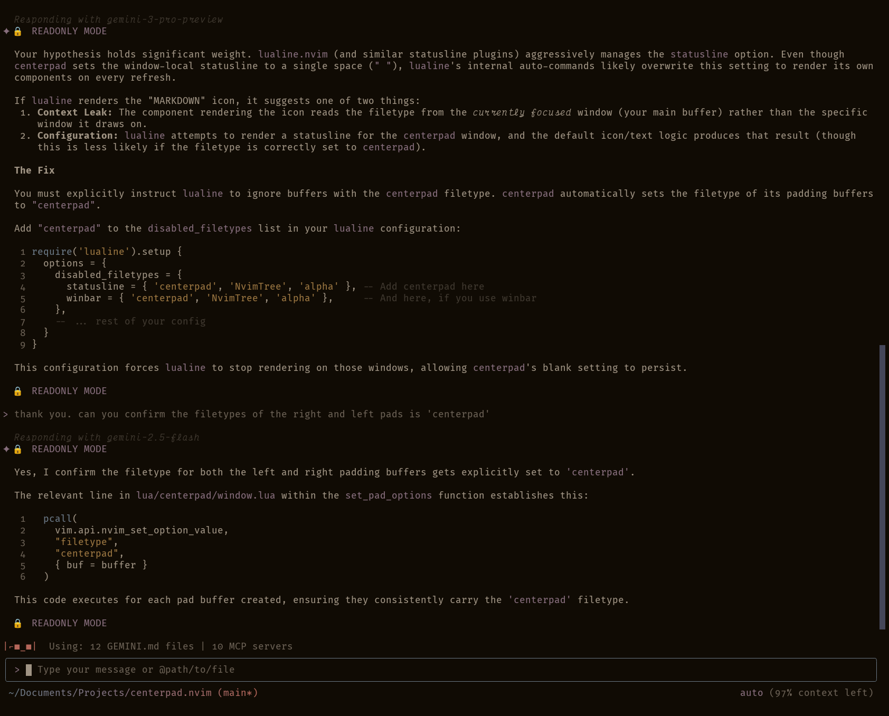

# A poor person's plan mode for the Gemini CLI



**If you don't like Gemini eagerly or randomly modifying, or even
deleting, files in your projects, look no further.**

This project provides a set of custom commands and skills to enforce a
structured, mode-based workflow for the Gemini CLI agent. These modes
guide the agent through the distinct phases of a software engineering
task—Perceive, Reason, Act, and Refine (`PRAR`)—ensuring a safe,
deliberate, and verifiable process.

**Important:** _Assuming you have hooks properly installed, all sessions
begin in `readonly` mode._

## Core concepts: Operational modes

Each custom command transitions the Gemini CLI agent into a specific
**operational mode**, each with its own set of permissions and
protocols. The system relies on the `.gemini_readonly` marker file,
which enforces a "Safe-Default" `readonly` state, preventing accidental
modifications.

- **Read-Only Modes (`/readonly`):** Assuming you have hooks properly
  installed, the agent starts all sessions in `readonly` mode. The mode
  serves as a perfect base for investigation, analysis, and planning.
  The system disables all file modification tools.
- **Write-Enabled Modes (`/writable`, `/build`, `/implement`):** Use
  these set of commands to disable `readonly` mode and enable file
  modification tools. These modes allow executing an approved plan. The
  agent removes the `.gemini_readonly` marker and enables file
  modification tools under strict protocols.

## Setup and installation

To use these custom modes, place the project files into your
`~/.gemini/` directory and configure your `settings.json` file.

### 1. Required directory structure

Place the files and directories from this project directly inside your
`~/.gemini/` directory. Your `~/.gemini/` folder should look like this:

```bash
~/.gemini/
├── settings.json
├── SYSTEM.md                              # Foundational operating principles
├── GEMINI.md                              # Project-specific directives
├── commands/
│   ├── build.toml
│   ├── implement.toml
│   ├── plan.toml
│   ├── readonly.toml
│   ├── review.toml
│   └── writable.toml
├── hooks/                                  # Enforcement and behavior hooks
│   ├── disable-readonly-sessionend.sh    # NEW: Clean session termination
│   ├── enable-readonly-startup.sh
│   ├── enforce-eprime.sh
│   ├── enforce-readonly.sh
│   └── remind-readonly-dynamic.sh
├── kbase/                                  # CONSOLIDATED: Unified knowledge base
│   ├── GEMINI.md
│   ├── agent-protocols.md
│   ├── cloud-patterns.md
│   ├── data-science-workflow.md
│   ├── e-prime-protocol.md
│   ├── engineering-principles.md
│   ├── gemini-prompt-engineering.md
│   └── ui-ux-design.md
└── skills/                                 # NEW: Skills-based architecture
    ├── build-mode/
    │   └── SKILL.md
    ├── implement-mode/
    │   └── SKILL.md
    ├── plan-mode/
    │   └── SKILL.md
    ├── readonly-mode/
    │   ├── SKILL.md
    │   ├── scripts/
    │   └── tests/
    ├── review-mode/
    │   └── SKILL.md
    └── write-mode/
        ├── SKILL.md
        ├── scripts/
        └── tests/
```

### 2. `settings.json` configuration

The `settings.json` file plays a crucial role for the Gemini CLI agent
to locate the `kbase` directory, enable the experimental skills feature,
configure hooks, and manage session lifecycle. Copy the settings in
`settings.json` from this project to your own in `~/.gemini/`. The file
includes:

- Experimental skills feature activation
- Tools hooks configuration (`enableHooks`)
- Context configuration for loading knowledge base
- Model configuration with custom aliases for temperature and output
  control
- Hooks configuration (`hooksConfig`) to enable hook system
- Hook definitions for read-only enforcement and session lifecycle

**Key hooks configured:**

- `SessionStart`: Creates `.gemini_readonly` marker when session begins
- `BeforeAgent`: Injects `readonly` reminders and enforces E-Prime
  communication protocol before agent execution
- `BeforeTool`: Blocks write operations (write, replace, shell commands,
  file operations, etc.) when `.gemini_readonly` marker exists
- `SessionEnd`: Removes `.gemini_readonly` marker when session
  terminates, ensuring clean exit state

The configuration follows this structure:

```json
{
  "experimental": {
    "skills": true
  },
  "tools": {
    "enableHooks": true
  },
  "context": {
    "loadMemoryFromIncludeDirectories": true,
    "includeDirectories": ["~/.gemini/kbase"]
  },
  "modelConfigs": {
    "customAliases": {
      "base": {
        "modelConfig": {
          "generateContentConfig": {
            "temperature": 0.1,
            "topP": 0.95
          }
        }
      },
      "chat-base": {
        "extends": "base",
        "modelConfig": {
          "generateContentConfig": {
            "temperature": 0.2,
            "topP": 0.9,
            "topK": 1
          }
        }
      }
    }
  },
  "hooksConfig": {
    "enabled": true
  },
  "hooks": {
    "SessionStart": [
      {
        "matcher": "startup",
        "hooks": [
          {
            "name": "enable-readonly-startup",
            "type": "command",
            "command": "~/.gemini/hooks/enable-readonly-startup.sh",
            "description": "Enables readonly mode automatically when a session starts"
          }
        ]
      }
    ],
    "BeforeAgent": [
      {
        "matcher": "*",
        "hooks": [
          {
            "name": "remind-readonly-before-agent",
            "type": "command",
            "command": "~/.gemini/hooks/remind-readonly-dynamic.sh",
            "description": "Injects readonly mode reminders into agent context"
          },
          {
            "name": "enforce-eprime",
            "type": "command",
            "command": "~/.gemini/hooks/enforce-eprime.sh",
            "description": "Enforces E-Prime directive by injecting system message"
          }
        ]
      }
    ],
    "BeforeTool": [
      {
        "matcher": "write_file|replace|run_shell_command|delete_file|create_directory|move_file|copy_file",
        "hooks": [
          {
            "name": "enforce-readonly",
            "type": "command",
            "command": "~/.gemini/hooks/enforce-readonly.sh",
            "description": "Blocks write operations when .gemini_readonly exists"
          }
        ]
      }
    ],
    "SessionEnd": [
      {
        "matcher": "exit",
        "hooks": [
          {
            "name": "disable-readonly-sessionend",
            "type": "command",
            "command": "~/.gemini/hooks/disable-readonly-sessionend.sh",
            "description": "Removes readonly mode marker when session ends"
          }
        ]
      }
    ]
  }
}
```

### 3. `SYSTEM.md` configuration (environment variable setup)

The `SYSTEM.md` file provides foundational operating principles
including the `PRAR` method, safety philosophy, risk assessment
framework, and operational modes. This file overrides the agent's core
directives when properly configured.

**To enable `SYSTEM.md`:**

Set the `GEMINI_SYSTEM_MD` environment variable to point to the file:

```bash
export GEMINI_SYSTEM_MD="~/.gemini/SYSTEM.md"
```

Or add it to your shell profile (`~/.bashrc`, `~/.zshrc`, etc.):

```bash
echo 'export GEMINI_SYSTEM_MD="~/.gemini/SYSTEM.md"' >> ~/.bashrc
source ~/.bashrc
```

**Important:** The `GEMINI_SYSTEM_MD` environment variable must exist
for `SYSTEM.md` to take effect. Without this variable, the agent uses
its default core directives.

---

### 4. `GEMINI.md` directive configuration

Choose between two options for configuring your main `GEMINI.md`
directive.

#### Option A (recommended): Full integration

For the most robust experience, use the full configuration provided in
this project:

1. Place the `SYSTEM.md` file at the root of your `~/.gemini/` directory
   (and set `GEMINI_SYSTEM_MD` environment variable per section 3).
2. Place the `GEMINI.md` file at the root of your `~/.gemini/`
   directory.
3. Place the `kbase/` directory at the root of your `~/.gemini/`
   directory.
4. Place the `hooks/` directory at the root of your `~/.gemini/`
   directory.
5. Configure hooks in your `~/.gemini/settings.json` (see "Hooks
   integration" section below). **This step ensures the read-only system
   functions correctly.**

`SYSTEM.md` establishes core foundational principles (via
`GEMINI_SYSTEM_MD` environment variable), while `GEMINI.md` provides
global project-specific directives and protocols. The `kbase/` directory
supplies detailed reference documentation. Together they create a
comprehensive operational framework ensuring the agent fully understands
and adheres to the underlying protocols and architectural knowledge
base.

#### Option B: Custom directive integration

If you prefer to use your own `GEMINI.md` directive, ensure you have a
read-only directive in yours. Preferably, just copy the read-only
directive sections from the `GEMINI.md` file provided in this project.

### 5. `.gitignore` configuration

To prevent committing the temporary `.gemini_readonly` marker to your
projects, add it to your global or project-specific `.gitignore` file.

```bash
# .gitignore
.gemini_readonly
```

## Skills system architecture

The project uses the Gemini CLI experimental skills feature to provide
structured, reusable command workflows. Each skill encapsulates a
specific operational mode with its own permissions, protocols, and
efficiency directives.

**Key benefits:**

- **Better encapsulation**: Each skill contains complete implementation
  logic
- **Improved portability**: Skills work independently across different
  contexts
- **Native CLI support**: Leverages the Gemini CLI built-in skills
  system
- **Cleaner separation**: Commands remain straightforward while skills
  handle complexity

### Skills directory structure

All skills live in `~/.gemini/skills/`:

- `readonly-mode/` - Enforces read-only safety with verification
- `write-mode/` - Removes read-only marker to enable writes
- `plan-mode/` - Investigation and strategic planning workflow
- `review-mode/` - Self-critique and validation protocols
- `build-mode/` - Builder mode execution with structured protocols
- `implement-mode/` - Autonomous plan execution workflow

### Skill file format

Each skill directory contains a `SKILL.md` file with YAML `frontmatter`:

```yaml
---
name: plan-mode
description:
  Investigates and creates a strategic plan to complete a task.
---
```

The `SKILL.md` file provides structured workflows with:

- **Goal:** Primary aim of the skill
- **When:** Trigger conditions for using the skill
- **Efficiency directives:** Token and context optimization rules
- **Workflow:** Step-by-step execution protocol with numbered steps

### Commands invoke skills

Commands in `commands/` directory provide the user interface by invoking
skills. For example:

- `/plan` command → invokes `plan-mode` skill → follows `SKILL.md`
  workflow
- `/build` command → invokes `build-mode` skill → follows `SKILL.md`
  workflow
- `/review` command → invokes `review-mode` skill → follows `SKILL.md`
  workflow

This separation allows commands to remain straightforward (typically 4
lines) while skills contain comprehensive implementation logic and
protocols.

### Migration from templates

Earlier versions used a template-based system with files in `templates/`
directory. The skills system replaces this with a more structured
approach using the Gemini CLI native skills support, providing:

- Stronger guarantees of skill invocation
- Better integration with CLI lifecycle
- More maintainable and modular architecture
- Clearer boundaries between user interface (commands) and
  implementation (skills)

## Hooks integration (required)

This project includes shell hooks that the read-only mode system
**requires** to function properly. These hooks enforce read-only mode at
the system level and serve as a critical component of the security
model.

**Prerequisite:** _Hooks require the nightly version of the Gemini CLI
app. Ensure you have the nightly build installed. Check your Gemini CLI
version with `gemini --version` and update to the nightly release if you
haven't already._

### Available hooks

#### `enforce-readonly.sh`

Blocks write operations when the `.gemini_readonly` marker exists.
Returns a JSON response denying the operation with clear messaging. This
script functions as a pre-flight check before any write tools execute.

**Location:** `~/.gemini/hooks/enforce-readonly.sh`

#### `remind-readonly-dynamic.sh`

Dynamically injects read-only reminders into agent context based on hook
events. Outputs contextual system messages reinforcing read-only
constraints and operational directives.

**Location:** `~/.gemini/hooks/remind-readonly-dynamic.sh`

#### `enable-readonly-startup.sh`

Automatically creates the `.gemini_readonly` marker file when a new
session starts, ensuring all sessions begin in read-only mode by default
(Safe-Default principle). This hook runs once at session initialization.

**Location:** `~/.gemini/hooks/enable-readonly-startup.sh`

#### `enforce-eprime.sh`

Enforces the E-Prime communication protocol by injecting system messages
that remind the agent to avoid `to be` verbs. E-Prime encourages more
precise, active language and clearer technical communication.

**Location:** `~/.gemini/hooks/enforce-eprime.sh`

#### `disable-readonly-sessionend.sh`

Automatically removes the `readonly` marker when a session ends,
ensuring clean exit states. Prevents stale `readonly` markers from
persisting between sessions and guarantees proper cleanup on session
termination.

**Location:** `~/.gemini/hooks/disable-readonly-sessionend.sh`

### How hooks work

The `settings.json` file configures the hooks to operate as follows:

1. **SessionStart hook**: When you start a Gemini CLI session:
   - `enable-readonly-startup.sh` executes to create the
     `.gemini_readonly` marker (Safe-Default principle)

2. **BeforeAgent hooks**: Before the agent processes any input:
   - `remind-readonly-dynamic.sh` runs to reinforce `readonly`
     constraints
   - `enforce-eprime.sh` runs to inject E-Prime communication reminders

3. **BeforeTool hook**: When the agent attempts to use write tools
   (`write_file`, `replace`, `run_shell_command`, `delete_file`,
   `create_directory`, `move_file`, `copy_file`), the
   `enforce-readonly.sh` hook intercepts and blocks the operation if
   `.gemini_readonly` marker exists

4. **SessionEnd hook**: When you exit a Gemini CLI session:
   - `disable-readonly-sessionend.sh` executes to remove the
     `.gemini_readonly` marker
   - This ensures clean session termination without stale markers
   - Prevents `readonly` mode from incorrectly persisting to future
     sessions

The hooks use pattern matching (`matcher` field) to apply only when
relevant:

- `SessionStart`: `matcher: "startup"` for `enable-readonly-startup.sh`
  (runs once at session start)
- `BeforeAgent`: `matcher: "*"` applies both hooks to all agent
  executions
- `BeforeTool`:
  `matcher: "write_file|replace|run_shell_command|delete_file|create_directory|move_file|copy_file"`
  (note the pipe-separated tool names) applies to all write and
  destructive operations
- `SessionEnd`: `matcher: "exit"` applies when session terminates

The system requires no further configuration—hooks come pre-configured
in the provided `settings.json` file.

---

## Understanding the operational modes

All operational modes operate through the skills system, which provides
structured workflows with safety protocols and efficiency directives.
Each command invokes a corresponding skill that implements the mode's
complete behavior.

### `/readonly`

- **Mode:** Strict Read-Only
- **Phase:** PERCEIVE
- **Description:** The default, most restrictive mode forbids all write
  operations.

### Explorer mode (default)

- **Mode:** Explorer Mode
- **Phase:** PERCEIVE
- **Description:** The default read-only mode for understanding code,
  mapping dependencies, and reviewing tests. This mode activates by
  default when a session starts (via `.gemini_readonly` marker). Note:
  The project removed the `/explore` command; Explorer Mode now
  functions as the default operational state.

### `/plan`

- **Mode:** Plan Mode
- **Phase:** REASON
- **Description:** For creating a comprehensive, strategic plan to
  achieve a goal.

### `/review`

- **Mode:** Review Mode
- **Phase:** REFINE
- **Description:** For critically self-reviewing a plan before
  execution.

### `/build`

- **Mode:** Builder Mode
- **Phase:** Act & REFINE
- **Description:** A write-enabled mode for executing plans and building
  solutions.

### `/implement`

- **Mode:** `Execution` Mode
- **Phase:** Act & REFINE
- **Description:** A more structured version of Builder Mode for
  autonomous plan execution.

### `/writable`

- **Mode:** Writable Mode
- **Phase:** Act
- **Description:** Removes the read-only lock, permitting direct write
  operations without a formal plan.

## `E-Prime` Communication protocol

E-Prime represents a variant of English that excludes all forms of the
verb `to be`. This project enforces E-Prime through the
`enforce-eprime.sh` hook to encourage more precise, active technical
communication.

**Why E-Prime?**

- **Clarity**: Forces more specific, descriptive language
- **Precision**: Eliminates ambiguous identity statements
- **Active Voice**: Encourages action-oriented descriptions
- **Reduced Assumptions**: Prevents treating opinions as facts

**Example transformations:**

- `The bug is in the parser` → `The parser contains the bug`
- `This is a security issue` → `This presents a security risk`
- `The code is inefficient` → `The code performs inefficiently`
- `It was fixed yesterday` → `We fixed it yesterday`
- `This approach is better` → `This approach performs better`

**Note:** The E-Prime hook injects reminders without blocking agent
responses. It serves as a communication guideline rather than a strict
enforcement mechanism.

---



## Illustrative workflow example

The following list outlines a typical workflow for using these modes to
fix a bug:

1. **Session Starts in Read-Only Mode:** Your session automatically
   begins with the `.gemini_readonly` marker created by
   `enable-readonly-startup.sh`, ensuring a safe-default state. You
   operate in Explorer Mode, which provides read-only access for
   investigation.
2. **Explore & Gather Context:** You ask the agent to investigate the
   bug. It uses read-only tools to understand the relevant code, trace
   dependencies, and review test coverage.
3. **/plan:** Once enough context accumulates, you ask the agent to
   create a strategic plan. It outlines the steps to fix the bug and,
   crucially, how to verify the fix.
4. **/review:** The agent performs a self-critique of its plan, checking
   for flaws from five engineering perspectives (security, QA,
   architecture, performance, DevOps).
5. **`/implement`:** With an approved plan, you direct the agent to
   execute it. The agent removes the read-only lock and carries out the
   changes, runs tests, and verifies the fix.
6. **Return to Read-Only or Session End:** Upon completion, the agent
   may return to read-only mode. When you exit the session, the
   SessionEnd hook automatically removes the `.gemini_readonly` marker
   for clean termination, preventing stale markers from persisting.

## Alternative workflows (expert use)

While the full cycle of `plan`, `review`, and `implement` (with
automatic initial Explorer Mode) provides the most safety and structure,
it often exceeds the needs of simpler tasks or more experienced users.
Here follow two more direct, less token-intensive workflows.

### Direct build workflow: default explorer mode → `/build`

This workflow suits situations where you have a clear goal and don't
need the formal planning and review phases.

1. **Session Starts in Read-Only Mode:** Your session automatically
   begins in Explorer Mode with the `.gemini_readonly` marker enabled
   (Safe-Default).
2. **/build:** Transition directly to the write-enabled "Builder Mode."
   The agent can now change files and execute commands, while still
   benefiting from the structured protocols of this mode.

### Direct write workflow: default explorer mode → `/writable`

This path offers the most direct way to enable write operations and
suits quick, straightforward edits where the overhead of a structured
mode proves unnecessary.

1. **Session Starts in Read-Only Mode:** Your session automatically
   begins in Explorer Mode with the `.gemini_readonly` marker enabled
   (Safe-Default).
2. **/writable:** This command removes the `.gemini_readonly` marker,
   immediately permitting the use of write tools without entering a
   formal mode.
